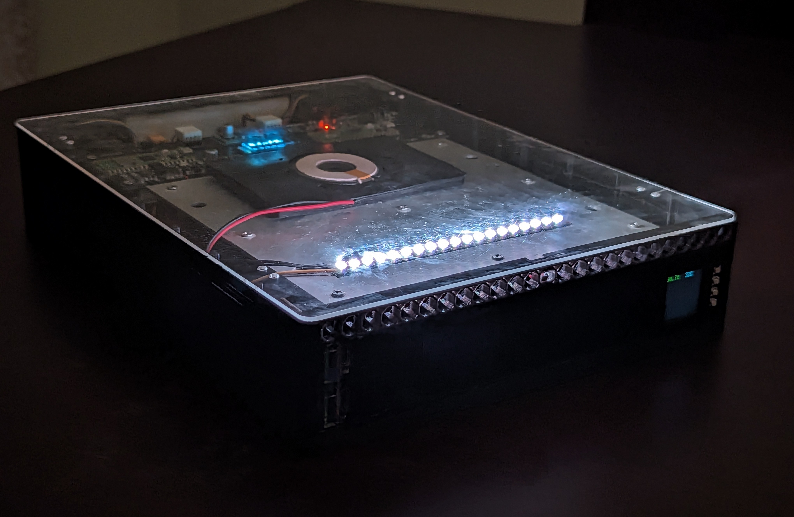
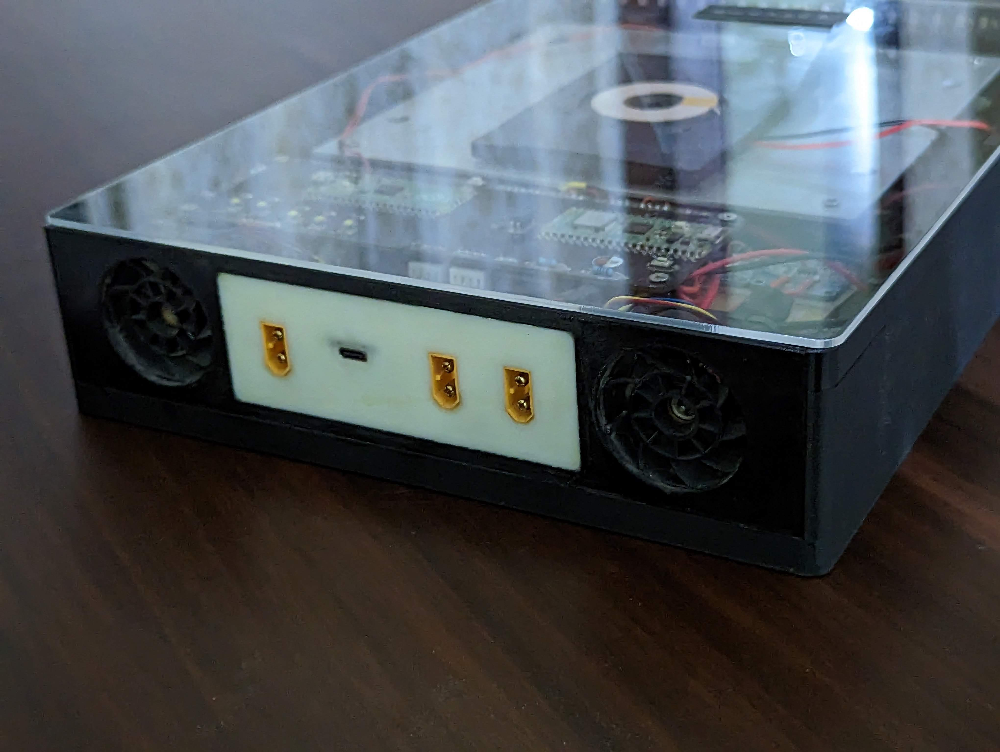
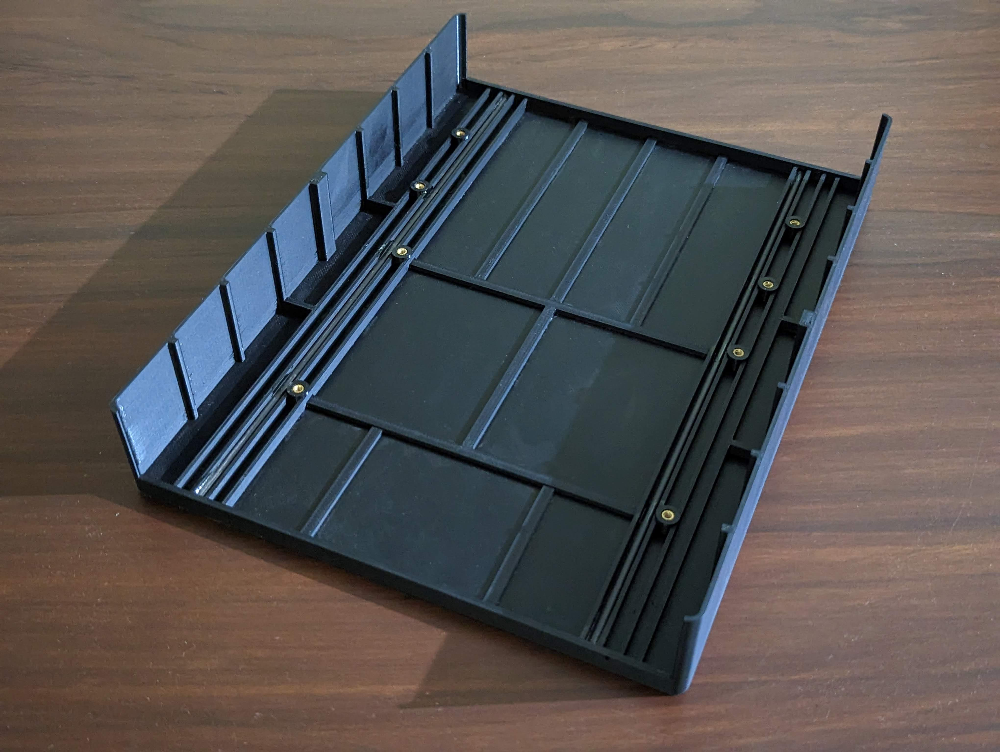
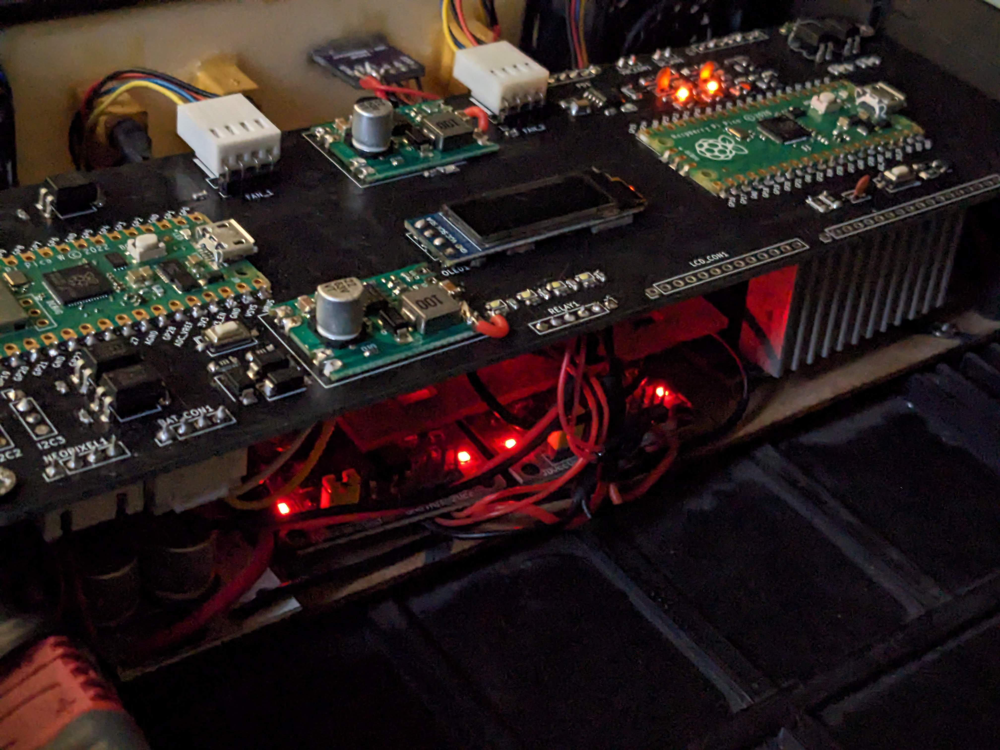
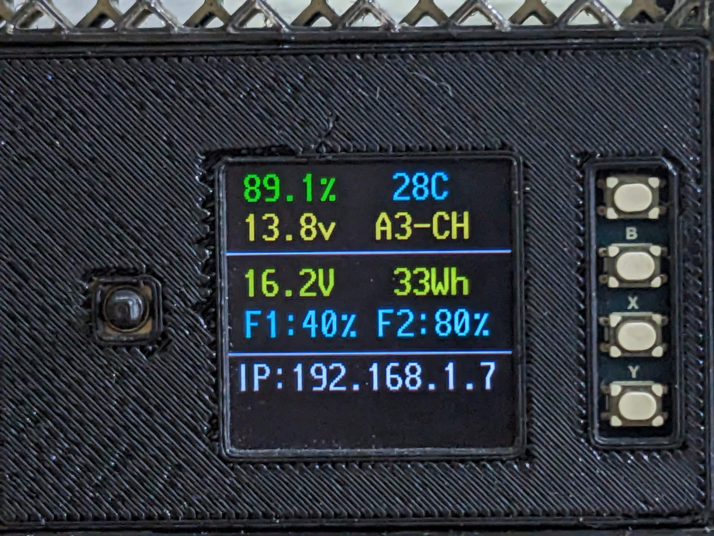

# Smart-Bat

# Design
Features:
- Lithium-ion battery pack capable of charging a regular phone 12x times
- Capable of providing power to 7x device simultaneously
- USB-C and DC input port, can be fully charged in less than 3 hours
- Coloured LCD with automatic brightness adjustment
- Joystick and buttons for easy interaction
- Wirelessly controlled with a phone or laptop via browser
- 3 lamp modes with different intensities
- over-temperature, over-current, short-circuit, over-voltage, under-voltage protection

Specs:
- 12.8v 153 Watt hour lithium iron phosphate ('LiFePo4') battery pack
- Raspberry Pi Pico W microcontroller board with wifi and bluetooth
- 2x USB-C and 2x USB-A ports capable of outputting 72 Watts combined, supports PD, PPS, QC fast charging protocols
- 10 Watt Qi wireless charger
- USB-C connector paired with CH224k PD sink controller and XT-60 connector for 16-40v input at upto 75 Watts
- 19 addressable RGB lights ('WS2812b')
- 1x XT-60 for direct battery voltage output at upto 256 Watts
- 1x XT-60 for charging external 4s lithium ion battery at upto 33 Watts
- 2x 5v cooling fans
- 4 automatic and 4 manual charging modes 

## Body
- 3D printed PLA body, the front and back being seperate 3D prints
- 8 threaded inserts to hold battery pack, components module in place
- reinforcing carbon fibre rods on the bottom 
- top cover is laser cut acrylic sheet held with 8 m3 screws

## Components module
The components module consists of two voltage/current sensors from Texas Instruments ('INA219'), digital potentiometer, two dc-dc voltage regulators, 4x 20A Relays all connected through a custom pcb.

## PCB
The [pcb](https://github.com/supreeet/Smart-Bat/tree/a5d27a213e3fed6b2bf3b1258488c426cedcd1ec/pcb) includes:
- Raspberry Pi Pico and Pico W
- 2x 5v dc-dc regulators
- 2x 4 pin fan connector
- monochrome OLED display
- CH224K USB-C sink controller
- 3x voltage divider circuits for ADC conversion
- 5x PNP transistor

## Display

- 0.96 inch 128x32 monochrome OLED ('SSD1306')
  

- 1.3 inch 240x240 RGB LCD ('ST7789')
  
  
